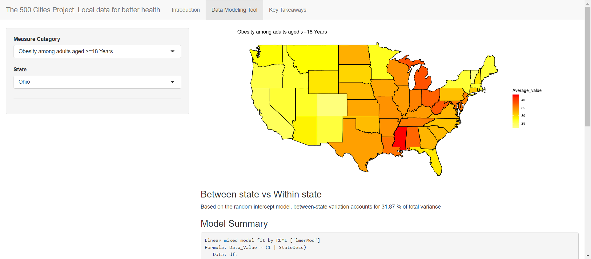
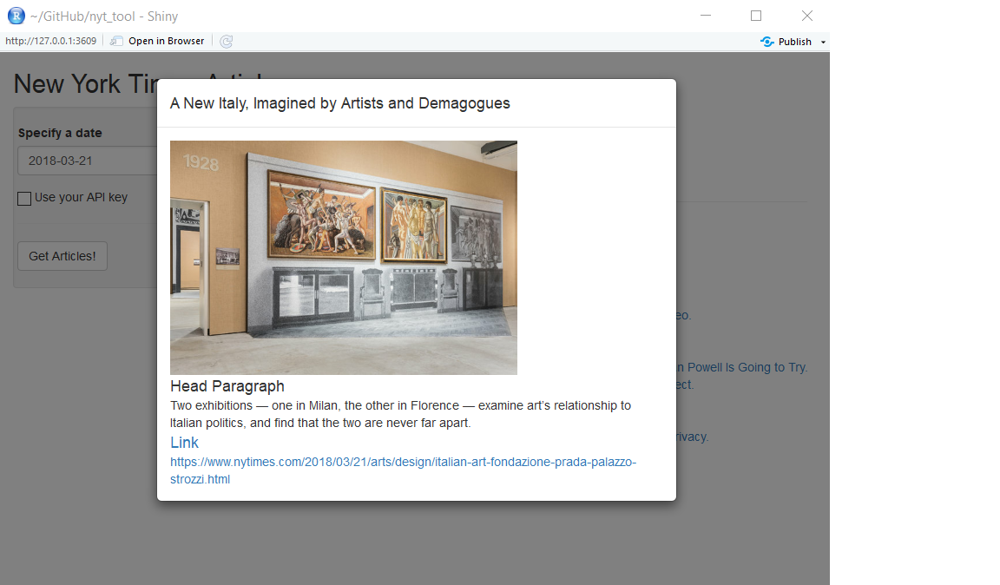

#### (1) A visualization and modeling tool for USA health data

- An interactive R shiny tool which provides health-related insights using data visualization and hierarchical models ([try it here](https://mingjiezhao.shinyapps.io/500_cities_app/)). 

Did you know which state has the most mental and physical health concerns? Did you know if the obesity rate in your state is higher than the national average? If you hope to learn more about these health-related facts, you may want to play with my tool created based on the big dataset of [500 Cities project 2018 release](https://catalog.data.gov/dataset/500-cities-local-data-for-better-health-2018-release). 

By selecting a health-related variable and a state, this tool will show you cool visualization of a map plot and two density plots. The tool also performs hierarchical model and show you if the variable vary significantly across the states.

The original code of the tool can be found on [my github](https://github.com/mingjiezhao/500_cities_for_better_health).

#### (2) An article search tool for New York Times

- This is a [shiny tool](https://github.com/mingjiezhao/nyt_api_tool) created by R to search news on New York Times based on NYT API. 

The goal of this app is to search for articles from New York Times API on a certain date and output a list of article names. By clicking on an article name listed in the search results, a pop-up window is displayed with more information about the article, including the first image in the article, a head paragraph (snippet), and a hyperlink which directs the users to the article on the New York Times' website.

#### (3) Machine learning application: Latent Dirichlet Allocation for text processing

- [Implementation of Latent Dirichlet Allocation ](https://github.com/mingjiezhao/Latent-Dirichlet-Allocation) using Python. 

Latent Dirichlet Allocation (LDA) is a very important model in machine learning area, which can automatically extract the hidden topics within a huge amount of documents and further represent the theme of each document as an ensemble of topics.

Two methods are used to implement the LDA algorithm: Expectation-Maximization (EM) and Gibbs Sampling.

The package is available to install: pip install pip install LDA-project-19

#### (4) Instacart data analysis with data visualization using Python

- [Jupyter Notebook on Github](https://github.com/mingjiezhao/Instacart_data_analysis) 

This data analysis is created based on the data from Kaggle's Instacart Market Basket Analysis, aims to provide business insights with data science techniques.

This analysis includes 3 parts: Sales analysis, Customer analysis, and Orders analysis 

Multiple key questions such as "What is the peak day and time of orders?", "Any differences in new customer group and existing customer group?", "what is the most common thing people get into the cart?", etc.

#### (5) SQL databse for USDA food description data

- [SQL databse for USDA by Python](https://github.com/mingjiezhao/USDA_database) 

Are you interested in getting to know more about food we have everyday? [United States Department of Agriculture](https://www.ars.usda.gov/northeast-area/beltsville-md-bhnrc/beltsville-human-nutrition-research-center/nutrient-data-laboratory/docs/usda-national-nutrient-database-for-standard-reference/) provides great resources about nutritions of daily food.

This project is written in Python to create a SQL database for USDA food data:

-The importdata.py establishs a SQL database (food.db) for USDA data (FOOD_DES.txt)

-The food_query.py takes SQL commends to make queries from the database
